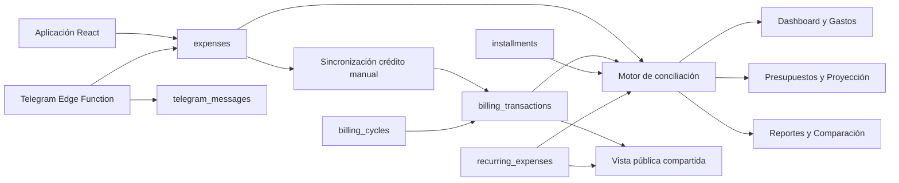

# Gastito · Control financiero personal

Aplicación web para registrar, conciliar, planificar y comprender las finanzas personales en un solo lugar. Gastito combina gastos manuales, movimientos de tarjetas, cuotas, recurrentes, presupuestos, cuentas, proyecciones y un bot de Telegram, con una interfaz responsive orientada a personas sin conocimientos financieros avanzados.

> Gastito es una herramienta personal de organización. Sus cálculos son informativos y no sustituyen asesoría financiera, contable o tributaria profesional.

## Estado del proyecto

- **Aplicación:** en uso y desplegada en producción.
- **Producción:** [gastito-control-gastos.vercel.app](https://gastito-control-gastos.vercel.app/)
- **Frontend:** React 18 + Vite 5.
- **Persistencia:** Supabase PostgreSQL + Auth + RLS.
- **Bot:** Telegram mediante Supabase Edge Function.
- **Zona horaria financiera:** `America/Santiago`.
- **Calidad:** el build ejecuta pruebas automáticas antes de compilar.

## Objetivos

Gastito busca responder preguntas prácticas:

- ¿Cuánto he gastado realmente este mes?
- ¿Qué parte del gasto corresponde a tarjeta, efectivo o transferencia?
- ¿Cuánto debo pagar en el próximo ciclo de cada tarjeta?
- ¿Qué compras continúan en cuotas durante los próximos meses?
- ¿Qué gastos son personales, del hogar o compartidos?
- ¿Cuánto dinero tengo realmente libre después de reservas y compromisos?
- ¿Cómo se compara mi ritmo de gasto con meses anteriores?
- ¿Qué ocurriría si realizo una compra nueva?

## Funcionalidades principales

### Movimientos y conciliación

- Registro manual de gastos desde la aplicación.
- Registro de gastos mediante Telegram.
- Gastos generados desde recurrentes.
- Integración de movimientos de CMR/Banco Falabella y Banco de Chile.
- Conciliación entre gastos manuales y movimientos bancarios para evitar duplicados.
- Sincronización automática de un gasto manual con Facturación cuando se registra como tarjeta de crédito y se identifica la tarjeta correspondiente.
- Categorías automáticas y edición manual de la clasificación.
- Estados visibles cuando una fuente no pudo cargarse y la vista contiene datos parciales.

### Facturación y tarjetas

- Ciclos por tarjeta con período, cierre y vencimiento.
- Monto informado por el banco, detalle leído y estimación del ciclo.
- Compras, cuotas, cargos, pagos y abonos separados.
- Estados de conciliación, pendientes y movimientos por revisar.
- Categorías, cuotas y montos compartidos visibles.
- Exportación CSV.

### Cuotas

- Seguimiento de compras bancarias en cuotas.
- Proyección de cuotas futuras.
- Conciliación con seguimientos manuales para evitar contar el mismo compromiso dos veces.
- Vista calendario y vista por planes.
- Identificación de cuotas confirmadas, proyectadas, pendientes o solo manuales.

### Cuentas, flujo y planificación

- Cuentas operativas y saldos disponibles.
- Separación entre saldo total, reservas comprometidas y dinero realmente libre.
- Próximos pagos obtenidos desde los ciclos reales de Facturación.
- Gastos recurrentes directos separados de los cargos que llegarán dentro de una tarjeta.
- Presupuestos por categoría con sugerencias basadas en el historial.
- Metas de ahorro y movimientos asociados.
- Proyección con escenarios comprometido, realista y simulado.

### Análisis

- Dashboard con indicadores conciliados.
- Reportes por período, categoría, banco, medio y origen.
- Comparación entre períodos equivalentes del mes actual y anterior.
- Tendencias mensuales y días sin gasto.
- Tooltips financieros que explican métricas en lenguaje cotidiano.

### Gastos compartidos

Gastito incluye un flujo especial para compartir gastos con una segunda persona sin darle acceso a toda la cuenta:

- selección de movimientos y recurrentes compartidos;
- porcentaje configurable;
- enlace público de solo lectura mediante token;
- ciclos actuales y futuros;
- cuotas proyectadas;
- categorías, aportes y resumen mensual;
- rotación y revocación del enlace.

El enlace público funciona como una **capability URL**: cualquier persona que conozca el token puede consultar el contenido compartido. El token no debe guardarse en el repositorio, capturas públicas, analítica ni logs.

### Telegram

- Vinculación de una cuenta de Telegram con un usuario de Supabase.
- Interpretación de monto, descripción, fecha, categoría, banco, débito/crédito y cuotas.
- Reconocimiento de fechas en español y zona horaria de Chile.
- Clasificación automática por palabras clave.
- Bandeja de mensajes sin interpretar para corrección manual.
- Respuesta de confirmación en Telegram.

## Módulos de la interfaz

| Grupo | Módulo | Propósito |
|---|---|---|
| Inicio | Dashboard | Resumen del período, saldo operativo, compromisos, categorías y próximos pagos. |
| Movimientos | Gastos | Lista conciliada de registros manuales y movimientos bancarios. |
| Movimientos | Facturación | Fuente principal para ciclos, estados de cuenta y pagos de tarjetas. |
| Movimientos | Cuotas | Planes bancarios, seguimientos manuales y proyecciones. |
| Planificación | Cuentas y flujo | Saldos, reservas, tarjetas y dinero libre. |
| Planificación | Presupuestos | Límites por categoría y ritmo de gasto. |
| Planificación | Recurrentes | Gastos fijos, ingresos, por cobrar y por pagar. |
| Planificación | Proyección | Escenarios futuros, riesgos y simulación de compras. |
| Planificación | Ahorros | Metas y movimientos de ahorro. |
| Análisis | Reportes | Resumen y composición de un período seleccionado. |
| Análisis | Comparación | Comparación temporal y por categoría. |
| Compartidos | Gastos con Nicol | Administración de gastos compartidos y enlace público. |
| Bot Telegram | Sin interpretar | Mensajes que requieren completar datos. |
| Bot Telegram | Configuración | Vinculación y prueba del bot. |
| Sistema | Mi perfil | Perfil y preferencias del usuario. |
| Sistema | Auditoría | Historial de acciones. |
| Sistema | Administración | Gestión disponible para el rol `super_admin`. |

## Rutas especiales

La aplicación principal no utiliza un router tradicional; `src/main.jsx` selecciona algunas vistas mediante parámetros de consulta.

| Ruta | Uso |
|---|---|
| `/` | Aplicación autenticada. |
| `/?nicol-admin=1` | Administración de movimientos de tarjeta compartidos. |
| `/?nicol-admin=recurrentes` | Administración de recurrentes compartidos. |
| `/?nicol=<token>` | Vista pública de solo lectura. |

No publiques un token real en documentación, issues o commits.

## Modelo financiero y fuente de verdad

Gastito conserva distintas fuentes porque cada una representa un concepto diferente:

1. **`expenses`** registra gastos manuales, Telegram y recurrentes.
2. **`billing_cycles` + `billing_transactions`** representan lo informado o estimado por cada tarjeta.
3. **`installments`** mantiene seguimientos manuales complementarios.
4. **`recurring_expenses`** contiene gastos fijos, ingresos, por cobrar y por pagar.
5. Los servicios de conciliación construyen una vista común para Dashboard, Gastos, Presupuestos, Reportes, Comparación y Proyección.

Reglas importantes:

- Facturación es la referencia principal para pagos de tarjetas.
- Un gasto de tarjeta no debe descontarse nuevamente como salida directa si ya está incluido en la factura.
- Pagos y abonos no se consideran compras.
- Los movimientos bancarios pendientes o marcados para revisión se muestran, pero pueden excluirse de ciertos cálculos.
- Las cuotas bancarias tienen prioridad sobre un seguimiento manual equivalente.
- Una reserva o deuda puede estar físicamente dentro de una cuenta sin considerarse dinero libre.



## Stack tecnológico

| Capa | Tecnología |
|---|---|
| UI | React 18 |
| Build | Vite 5 |
| Estilos | Tailwind CSS 3 + variables CSS |
| Tipografía | Manrope + JetBrains Mono |
| Base de datos | PostgreSQL en Supabase |
| Autenticación | Supabase Auth |
| Cliente de datos | `@supabase/supabase-js` |
| Backend del bot | Supabase Edge Functions / Deno |
| Despliegue | Vercel |
| Pruebas | Node.js Test Runner |

## Requisitos

- Node.js 20 o superior recomendado.
- npm.
- Proyecto de Supabase.
- Supabase CLI para migraciones y Edge Functions.
- Proyecto de Vercel para producción.
- Bot de Telegram creado con `@BotFather` si se habilita la integración.

## Inicio rápido

```bash
git clone https://github.com/wladimick/gastito-control-gastos.git
cd gastito-control-gastos
npm install
cp .env.example .env.local
npm run dev
```

La aplicación quedará disponible normalmente en `http://localhost:5173`.

### Modo demo

Cuando `VITE_SUPABASE_URL` o `VITE_SUPABASE_PUBLISHABLE_KEY` no están configuradas, `src/lib/supabase.js` deja el cliente en `null` y la aplicación usa los datos de demostración de `src/data.js`.

El modo demo sirve para revisar la interfaz, pero sus datos no representan la lógica completa de producción ni persisten como los registros de Supabase.

## Variables de entorno

### Frontend Vite

```env
VITE_SUPABASE_URL=https://xxxxxxxxxxxx.supabase.co
VITE_SUPABASE_PUBLISHABLE_KEY=sb_publishable_...
```

| Variable | Exposición | Uso |
|---|---|---|
| `VITE_SUPABASE_URL` | Pública en el bundle | URL del proyecto Supabase. |
| `VITE_SUPABASE_PUBLISHABLE_KEY` | Pública en el bundle | Clave publicable protegida por Auth y RLS. |

No uses `SUPABASE_SERVICE_ROLE_KEY` en variables que comiencen con `VITE_`.

### Supabase Edge Function de Telegram

Configura los secretos mediante Supabase CLI:

```bash
supabase secrets set TELEGRAM_BOT_TOKEN="<token>"
supabase secrets set TELEGRAM_WEBHOOK_SECRET="<secreto-aleatorio>"
```

Las Edge Functions reciben automáticamente `SUPABASE_URL` y `SUPABASE_SERVICE_ROLE_KEY` desde Supabase. La `service_role` nunca debe exponerse al navegador.

## Supabase

### Estructura actual

La base de producción contiene las siguientes tablas públicas:

| Área | Tablas |
|---|---|
| Usuarios y configuración | `profiles`, `user_settings`, `app_settings` |
| Catálogos | `categories`, `banks`, `payment_methods` |
| Gastos | `expenses`, `budgets` |
| Recurrentes | `recurring_expenses` |
| Tarjetas y facturación | `credit_cards`, `billing_cycles`, `billing_transactions` |
| Gastos compartidos | `billing_share_links` |
| Cuotas | `installments` |
| Cuentas y ahorro | `accounts`, `savings_goals`, `savings_movements` |
| Telegram | `telegram_accounts`, `telegram_messages`, `linking_codes` |
| Sistema | `audit_logs` |

Entre las funciones PostgreSQL relevantes se encuentran:

- `sync_manual_credit_expense_to_billing`
- `refresh_billing_cycle_estimate`
- `assign_billing_transaction_category`
- `assign_recurring_expense_category`
- `infer_expense_category_id`
- `create_or_rotate_nicol_share`
- `get_nicol_share`
- `get_nicol_share_cycles`
- funciones de roles y administración

### Migraciones

Las modificaciones incrementales se encuentran en `supabase/migrations/`. Para una instalación nueva, enlaza el proyecto y aplica las migraciones:

```bash
supabase login
supabase link --project-ref <project-ref>
supabase db push
```

Antes de ejecutar migraciones sobre producción:

1. revisa el SQL;
2. crea respaldo;
3. valida los cambios en un entorno separado;
4. comprueba RLS, funciones `SECURITY DEFINER` y permisos de ejecución;
5. evita incluir IDs generados o datos personales en migraciones estructurales.

### Autenticación y RLS

- La aplicación usa Supabase Auth.
- Las tablas de usuario aplican Row Level Security.
- Las políticas deben limitar el acceso mediante `auth.uid()` y `user_id`.
- Los roles administrativos se resuelven desde funciones SQL, no desde valores controlados por el cliente.
- Las tablas globales de catálogo permiten lectura según sus políticas.
- Los endpoints públicos compartidos devuelven únicamente datos sanitizados.

## Telegram Bot

La función principal está en:

```text
supabase/functions/telegram-webhook/index.ts
```

Flujo simplificado:

```text
Telegram
  → telegram-webhook
  → valida el secreto y la cuenta vinculada
  → guarda telegram_messages
  → interpreta el texto
  → crea o completa expenses/installments
  → responde al chat
```

### Desplegar la función

```bash
supabase functions deploy telegram-webhook
```

### Registrar el webhook

```bash
curl -X POST "https://api.telegram.org/bot${TELEGRAM_BOT_TOKEN}/setWebhook" \
  -d "url=https://<project-ref>.supabase.co/functions/v1/telegram-webhook" \
  -d "secret_token=${TELEGRAM_WEBHOOK_SECRET}"
```

El parser reconoce expresiones en español, bancos, categorías, fechas relativas o explícitas, débito/crédito y compras en cuotas. Los mensajes incompletos permanecen en la bandeja **Sin interpretar**.

## Fechas y zona horaria

Las fechas financieras requieren distinguir dos formatos:

- `timestamptz`: eventos reales con hora, guardados en UTC y presentados en Chile.
- `YYYY-MM-DD`: fechas bancarias o de vencimiento sin hora.

Reglas del proyecto:

- usar `America/Santiago` para fechas y horas del usuario;
- no convertir una fecha bancaria sin hora mediante `new Date('YYYY-MM-DD')`;
- conservar fechas de ciclo como valores calendario;
- utilizar los helpers de `src/lib/financialDates.js`;
- ejecutar las pruebas antes de modificar cierres, vencimientos o comparaciones mensuales.

## Scripts

| Comando | Descripción |
|---|---|
| `npm run dev` | Inicia Vite en desarrollo. |
| `npm test` | Ejecuta las pruebas de `tests/*.test.js`. |
| `npm run build` | Ejecuta pruebas y luego genera `dist/`. |
| `npm run preview` | Sirve localmente el build de producción. |

El build falla si las pruebas no pasan.

## Pruebas y validación

Actualmente existen pruebas automáticas para reglas financieras críticas, entre ellas:

- conservación de fechas bancarias sin hora;
- conversión UTC a fecha local de Chile;
- cálculo de meses anteriores y su duración;
- selección del monto final o de la mejor estimación de un ciclo.

Para cambios de lógica financiera se recomienda agregar pruebas que cubran:

- cierres y vencimientos;
- cuotas y proyecciones;
- conciliación de duplicados;
- pagos y abonos;
- recurrentes directos versus cargos en tarjeta;
- igualdad de totales entre Facturación, Dashboard y Cuentas.

## Estructura del repositorio

```text
.
├── docs/                         # Historial y documentación de cambios
├── public/                       # Recursos estáticos
├── src/
│   ├── App.jsx                   # Auth, estado y coordinación de módulos
│   ├── main.jsx                  # Entrada y rutas especiales por query string
│   ├── components/               # Páginas, modales y componentes compartidos
│   ├── data.js                   # Datos de demostración y catálogos UI
│   ├── lib/                      # Supabase, fechas, ayudas y utilidades
│   ├── services/                 # Acceso a datos y motores financieros
│   └── index.css                 # Variables visuales y estilos globales
├── supabase/
│   ├── functions/
│   │   └── telegram-webhook/     # Edge Function del bot
│   ├── migrations/               # Evolución de PostgreSQL
│   ├── schema.sql                # Esquema base histórico
│   └── seed.sql                  # Datos iniciales históricos
├── tests/                        # Pruebas con Node Test Runner
├── .env.example
├── package.json
├── tailwind.config.js
├── vercel.json                   # Rewrite SPA
└── vite.config.js                # Vite y separación de bundles
```

### Organización del frontend

- `components/`: interfaz, páginas y flujos de usuario.
- `services/`: consultas Supabase, normalización y conciliación.
- `lib/financialDates.js`: reglas de fechas financieras.
- `lib/financialHelp.js`: glosario usado por los tooltips.
- `components/ui.jsx`: componentes visuales compartidos.
- `components/Layout.jsx`: navegación responsive y menú lateral.

## Despliegue en Vercel

1. Importa el repositorio en Vercel.
2. Selecciona el preset **Vite**.
3. Configura `VITE_SUPABASE_URL` y `VITE_SUPABASE_PUBLISHABLE_KEY` en los ambientes correspondientes.
4. Ejecuta el deployment.

`vercel.json` redirige las rutas al `index.html` para mantener el comportamiento SPA.

Cada push o PR genera un preview. La rama `main` despliega a producción mediante la integración de GitHub con Vercel.

## Flujo de desarrollo

1. Crear una rama desde `main`.
2. Realizar cambios pequeños y verificables.
3. Documentar cambios relevantes en `docs/` con fecha y objetivo.
4. Ejecutar:

   ```bash
   npm test
   npm run build
   ```

5. Revisar el preview de Vercel.
6. Abrir un Pull Request con alcance, archivos, validación y riesgos.
7. Fusionar solo con build correcto.
8. Comprobar el deployment de producción.

Convención de ramas sugerida:

```text
feat/<descripcion>
fix/<descripcion>
docs/<descripcion>
```

## Seguridad

- No subir `.env.local`, tokens, service roles ni enlaces públicos reales.
- La clave publicable de Supabase puede estar en el frontend; la seguridad depende de RLS correctamente configurado.
- No ejecutar consultas con `service_role` desde el navegador.
- Rotar el enlace compartido cuando se haya expuesto accidentalmente.
- Sanitizar toda respuesta pública para no revelar usuario, correo, banco completo, archivos fuente ni metadatos internos.
- Revisar cuidadosamente funciones `SECURITY DEFINER` y permisos `EXECUTE`.
- No almacenar números completos de tarjetas; utilizar únicamente alias y últimos cuatro dígitos.

## Diagnóstico rápido

### La aplicación muestra datos de demostración

Comprueba que existen las variables:

```env
VITE_SUPABASE_URL=...
VITE_SUPABASE_PUBLISHABLE_KEY=...
```

Reinicia Vite después de cambiar `.env.local`.

### Una página muestra menos movimientos de los esperados

- Revisa el indicador de salud de datos.
- Actualiza la página.
- Comprueba Facturación y el ciclo seleccionado.
- Verifica si el movimiento está pendiente, no afecta el total o fue conciliado con otro registro.

### Un gasto manual con crédito no aparece en Facturación

Comprueba que:

- el medio de pago sea tarjeta;
- el tipo sea crédito;
- exista una tarjeta vinculada al banco seleccionado;
- la fecha caiga dentro de un ciclo válido;
- la escritura en Supabase haya sido confirmada.

### Las fechas aparecen desplazadas

- usa los helpers financieros del proyecto;
- no conviertas fechas `YYYY-MM-DD` como timestamps UTC;
- revisa la zona horaria del dispositivo;
- ejecuta las pruebas de fechas.

### Telegram no responde

- revisa `TELEGRAM_BOT_TOKEN`;
- confirma el webhook en Telegram;
- verifica `TELEGRAM_WEBHOOK_SECRET`;
- revisa logs de la Edge Function;
- confirma que la cuenta de Telegram esté vinculada.

## Documentación adicional

La carpeta `docs/` contiene notas de implementación, auditorías y decisiones históricas. Algunas guías antiguas describen etapas previas del proyecto; para instalación, arquitectura y operación actual, este README es la referencia principal.

## Privacidad

Gastito procesa información financiera personal. Una instalación real debe aplicar prácticas de minimización, acceso limitado, respaldo y eliminación segura. Evita utilizar datos reales en capturas públicas, issues, documentación de ejemplo o entornos compartidos.

## Licencia

El repositorio no declara actualmente una licencia de código abierto. Salvo que se agregue un archivo `LICENSE`, el código conserva todos los derechos de su autor.
